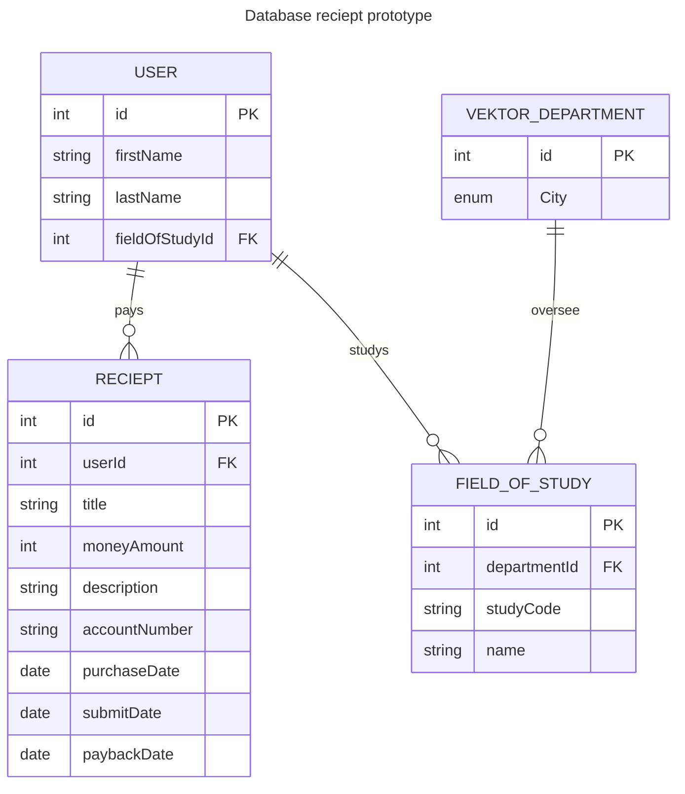

```mermaid
---
title: Database reciept prototype
---
erDiagram
    USER {
        int id PK
        string firstName
        string lastName 
        int fieldOfStudyId FK
    }
    RECIEPT {
        int id PK
        int userId FK
        string title
        int moneyAmount
        string description
        string accountNumber
        date purchaseDate
        date submitDate
        date paybackDate
    }
    FIELD_OF_STUDY {
        int id PK
        int departmentId FK
        string studyCode
        string name
    }
    VEKTOR_DEPARTMENT {
        int id PK
        enum City
    }
    USER ||--o{ RECIEPT : "pays"
    USER ||--o{ FIELD_OF_STUDY : studys
    VEKTOR_DEPARTMENT ||--o{ FIELD_OF_STUDY : oversee
```